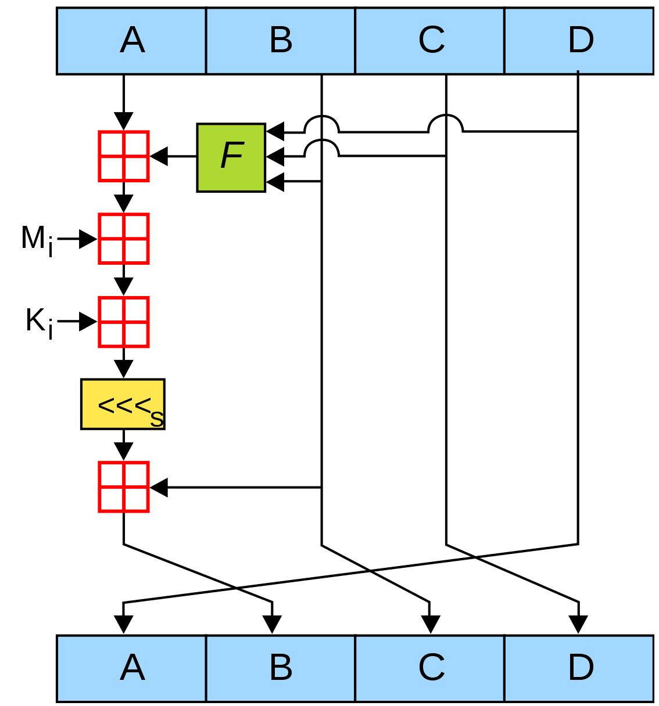
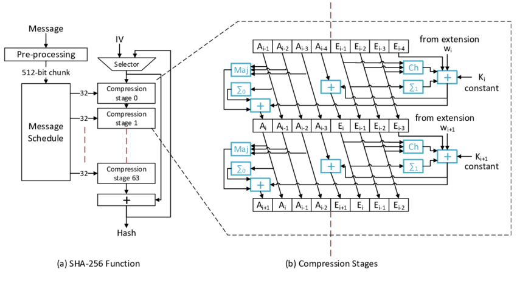

# ft_ssl [md5] [sha256]

## An introduction to cryptographic hashing algorithms

```
D. R.
darodrig @ 42madrid.com
```
_Summary: This project is the gateway to the encryption branch. You will recode part of
the OpenSSL program, specifically the MD5 and SHA-256 hashing algorithms._




